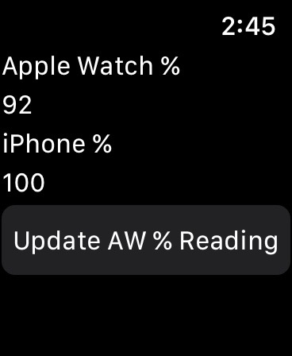

# iPhoneBatteryClient
An Apple Watch app that displays battery levels from a paired iPhone

I've got no clue if this thing is functional or not. At one point it was, but I recently dug this out of my backups and posted it on GitHub. No clue if the version here is the version that works.

A sample screenshot can be found below:

I believe this screenshot is from this version, but I am not entirely sure.
