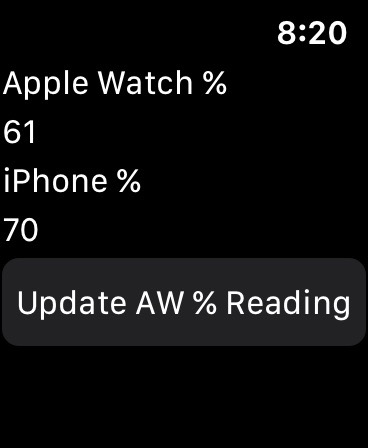
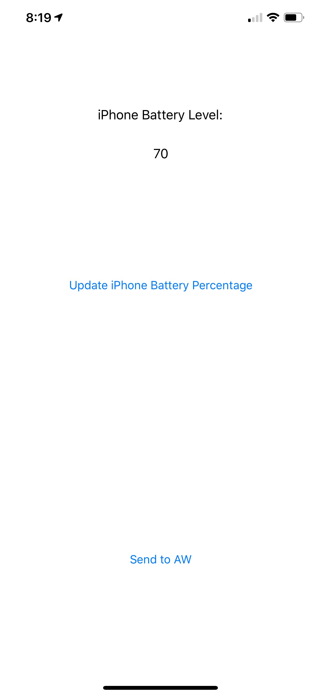

# iPhoneBatteryClient
An Apple Watch and iPhone app that displays battery levels from a paired iPhone

### Apple Watch app

Press the "Update AW % Reading" button in the Apple Watch app to fetch the latest Apple Watch battery percentage. This will update the number under the "Apple Watch %" field.

### iPhone app

Press "Update iPhone Battery Percentage" to fetch the latest iPhone battery percentage. It will display in the iPhone app under "iPhone Battery Level"

Press "Send to AW" to send this information to the Apple Watch. It will appear in the Watch app under the "iPhone %" field.

### Sample Screenshots

Apple Watch UI:

iPhone UI:

